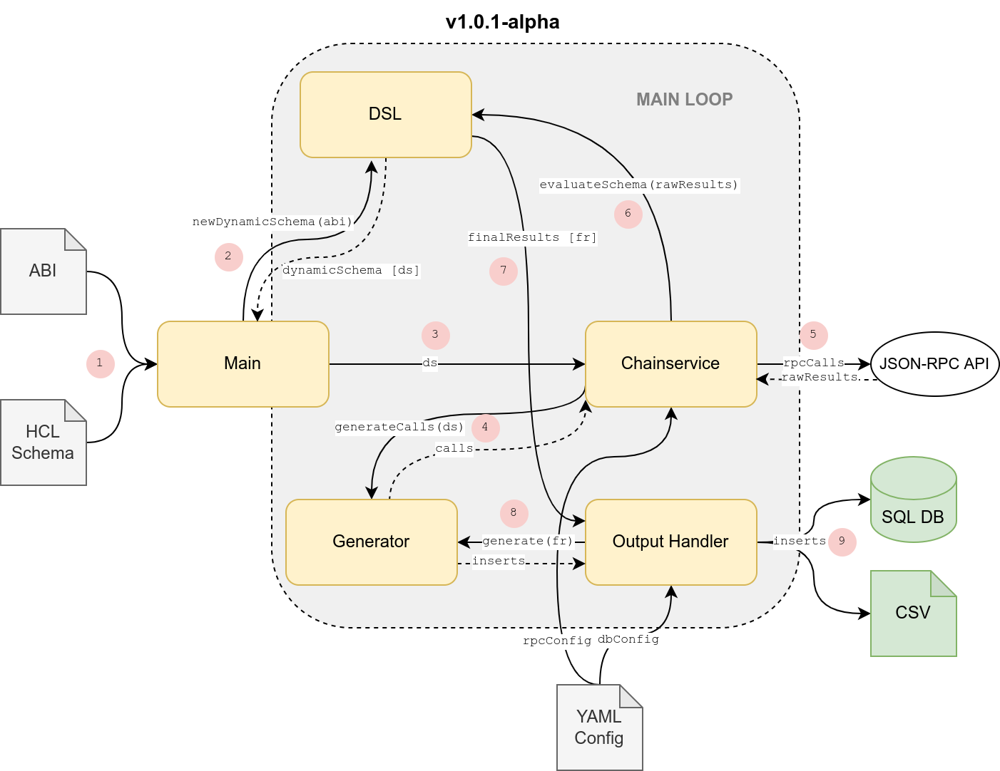

# Apollo
> **Query**, **transform**, **filter** and **save** EVM based chaindata using a simple schema



## Documentation
For detailed documentation, visit [apollo.chainbound.io](https://apollo.chainbound.io).

## Installation
```bash
go install github.com/chainbound/apollo
```

## Usage
### Setting up
First, generate the config directory and files:
```
apollo init
```
This will generate the configuration files (`config.yml` and `schema.hcl`) and put it into your configuration
directory, which will either be `$XDG_CONFIG_HOME/apollo` or `$HOME/.config/apollo`. This is the directory
in which you have to configure `apollo`, and it's also the directory where `apollo` will try to find the specified
contract ABIs.

`$HOME/.config/apollo/config.yml` will be configured with some standard chains and public RPC APIs. These will not do
for most queries, and we recommend either using your own node, or getting one with a node provider
like Alchemy or Chainstack.

`$HOME/.config/apollo/schema.hcl` is configured with a default schema that you can try out.

### Running
**Important**: running `apollo` with the default parameters has a high rate-limit, and your node provider might not like that.
Please check the [rate limiting](https://apollo.chainbound.io/getting-started#rate-limiting) section in the documentation. Hint:
set the `--rate-limit` flag to something low like 10.

#### Realtime mode
After defining the schema (with `time_interval`), run
```bash
apollo --realtime --stdout
```

#### Historical mode
After defining the schema with `start`, `end` and `interval` parameters, just run
```bash
apollo --stdout
```

## Output
There are 3 output options:
* `stdout`: this will just print the results to your terminal.
* `csv`: this will save your output into a csv file. The name of your file will be the name of your `query`. The other columns
will be made up of what's defined in the `save` block.
* `db`: this will save your output into a Postgres SQL table, with the table name matching your `query` name. The settings are defined in `config.yml` in your `apollo` config directory.
